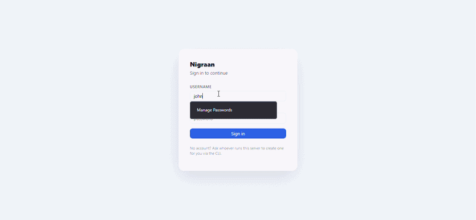

# Nigraan

*Nigraan* (نگران) — Urdu for "overseer" or "caretaker."

A self-hosted project management and Gantt-scheduling app for small teams who want full control of their own data — no SaaS subscription, no third-party server, no per-seat pricing. One process, one SQLite file, your own machine.



## Features

### Dashboard — a real project overview

- Task status broken down across all five states — Not Started, In Progress, Done, Blocked, Not Pursuing — in one pie chart
- **Schedule Health**: your committed target release date vs. the forecast computed live from the current schedule, with a plain-language "X work days ahead/behind" verdict
- At-a-glance counts for overdue, unassigned, and blocked tasks
- Per-milestone progress bars
- Time already invested in deprioritized work, so shelved effort isn't silently forgotten

### Timeline — an interactive Gantt chart

- Color-coded by status — subtasks render in a lighter tint of their status color, parent/summary rows in a darker one, so hierarchy and status both read at a glance
- Drag a bar to move it, drag its right edge to resize, drag the link handle to add a dependency
- Parent tasks roll up their subtasks into a single summary bar with a live done-count
- Any day worked beyond a task's original estimate shows up directly on the bar as a light-orange stripe — scope creep is visible without opening the task
- The committed target release date and the live forecast both appear as distinct markers on the calendar
- Opens landed on today, and scrolls freely both backward and forward — never boxed in by whatever the schedule happens to compute right now

### Tasks — a structured list view

- Milestones, parent tasks, and subtasks in one collapsible list
- Category (Definitive/Research), original estimate, current/actual days worked, assignee, status, and a comments/reason column
- Every task requires an estimate at creation — no silent defaults to paper over later

### Members & Resources

- Add a teammate by username, or create a brand-new account for them inline — no separate admin step required for day-to-day team changes
- Per-person allocation view flags anyone double-booked across overlapping tasks
- Leave tracked per person, factored directly into scheduling around it

### Roles built for real teams

- **Admin** — full access to every project without ever cluttering any of them as a "member"
- **Project Owner (PO)** — manages members, settings, and baselines for their project(s); a project can have multiple POs
- **Member** — works tasks, logs leave, and creates milestones, without touching project settings
- All account and project management happens through the UI — no server-side scripting required to onboard anyone

### Baselines

- Snapshot a project's plan at any point, then compare it against the live schedule later to see exactly what drifted and by how much

### Real-time collaboration

- WebSocket-backed presence indicators and "editing" badges show who's looking at what, live
- Full undo/redo history on every edit

## Running it

```bash
npm install
npm --prefix server install
npm run build
npm run server
```

Then open `http://localhost:3001` — the first visitor sets up the admin account, no server access needed.

For running it on a shared machine (LAN or beyond), see [progress.md](progress.md) for the full build history and architecture notes.

## Tech stack

React + TypeScript + Vite on the frontend; Node/Express + WebSocket on the backend; SQLite via Node's built-in `node:sqlite` (no native compile step) for storage.
